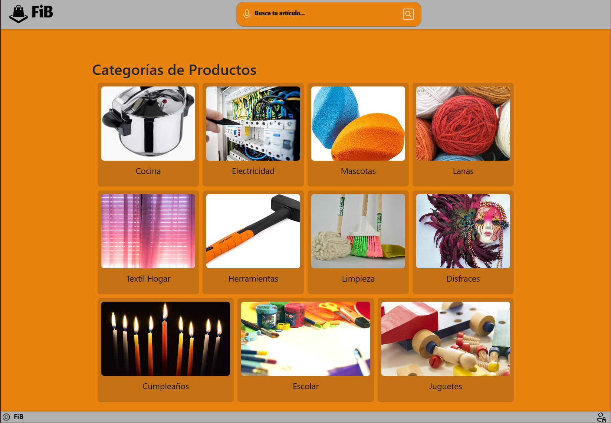
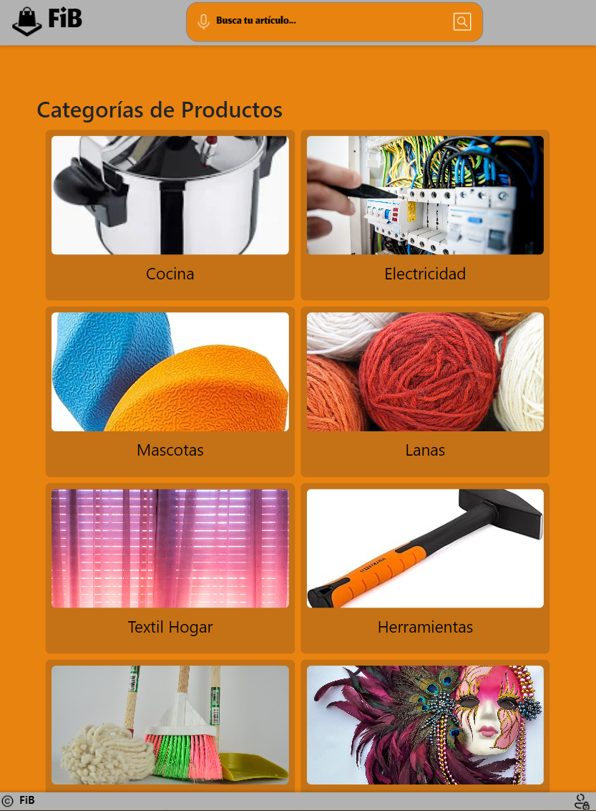
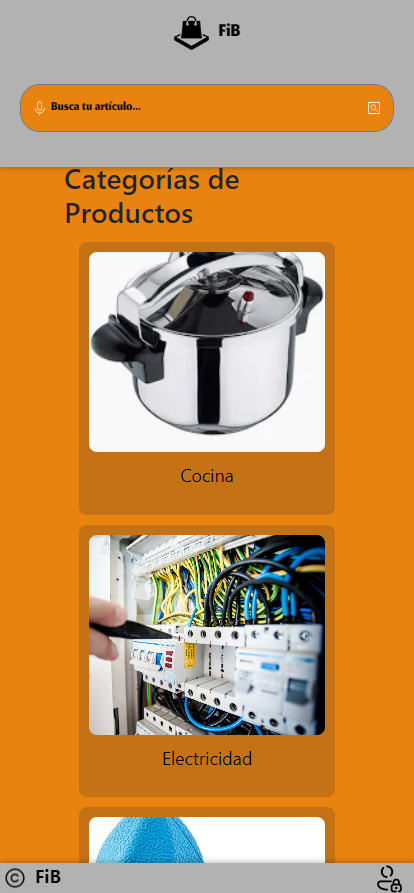

# FIB (Proyecto personal)

# Descripción

**FIB** (Find In Bazaar) es una innovadora aplicación diseñada para facilitar la búsqueda de productos en un bazar. Con FIB, los usuarios pueden encontrar rápidamente el lugar exacto donde se encuentran los productos que necesitan. La aplicación ofrece información detallada sobre la ubicación de cada artículo, incluyendo:

- **Pasillo**: Indica en qué pasillo se encuentra el producto, lo que permite a los usuarios localizarlo con facilidad.
- **Estante**: Especifica el estante dentro del pasillo, ayudando a reducir el tiempo de búsqueda.
- **Lado**: Proporciona información sobre el lado del estante donde está ubicado el producto, garantizando una experiencia de compra eficiente.

Además de su funcionalidad principal, FIB incluye una robusta sección de administración que permite a los dueños del bazar realizar diversas acciones, tales como:

- **Agregar Productos**: Los administradores pueden introducir nuevos productos en la base de datos, asegurando que la información esté siempre actualizada.
- **Eliminar Productos**: Permite la eliminación de productos que ya no están disponibles, manteniendo la base de datos limpia y relevante.
- **Editar Productos**: Facilita la actualización de la información de los productos existentes, como precios, descripciones y ubicaciones.
- **Visualizar Productos**: Ofrece una interfaz amigable para visualizar todos los productos disponibles en el bazar, con filtros y opciones de búsqueda para mejorar la usabilidad.

Con una interfaz intuitiva y un diseño responsivo, FIB se adapta a diferentes dispositivos, asegurando que los usuarios puedan acceder a la información desde cualquier lugar. La aplicación está diseñada tanto para clientes que buscan productos como para administradores que gestionan el inventario, haciendo de FIB una herramienta esencial en la experiencia de compra en el bazar.

## Página Web

## iPad & Phone

# Frontend: 
  - Vue.js
  - Vue Router
  - Pinia (para gestión de estado)
  - Axios (para realizar solicitudes HTTP)
  - Bootstrap (para diseño responsivo)

# Clona el repositorio en tu máquina local:
 
git clone <https://github.com/AntonellaEL/ProyectoPersonal>

# Navega a la carpeta del proyecto:

cd frontendpersonal

# Instala las dependencias utilizando npm : 
npm install

# Ejecuta la aplicación:

npm run dev
